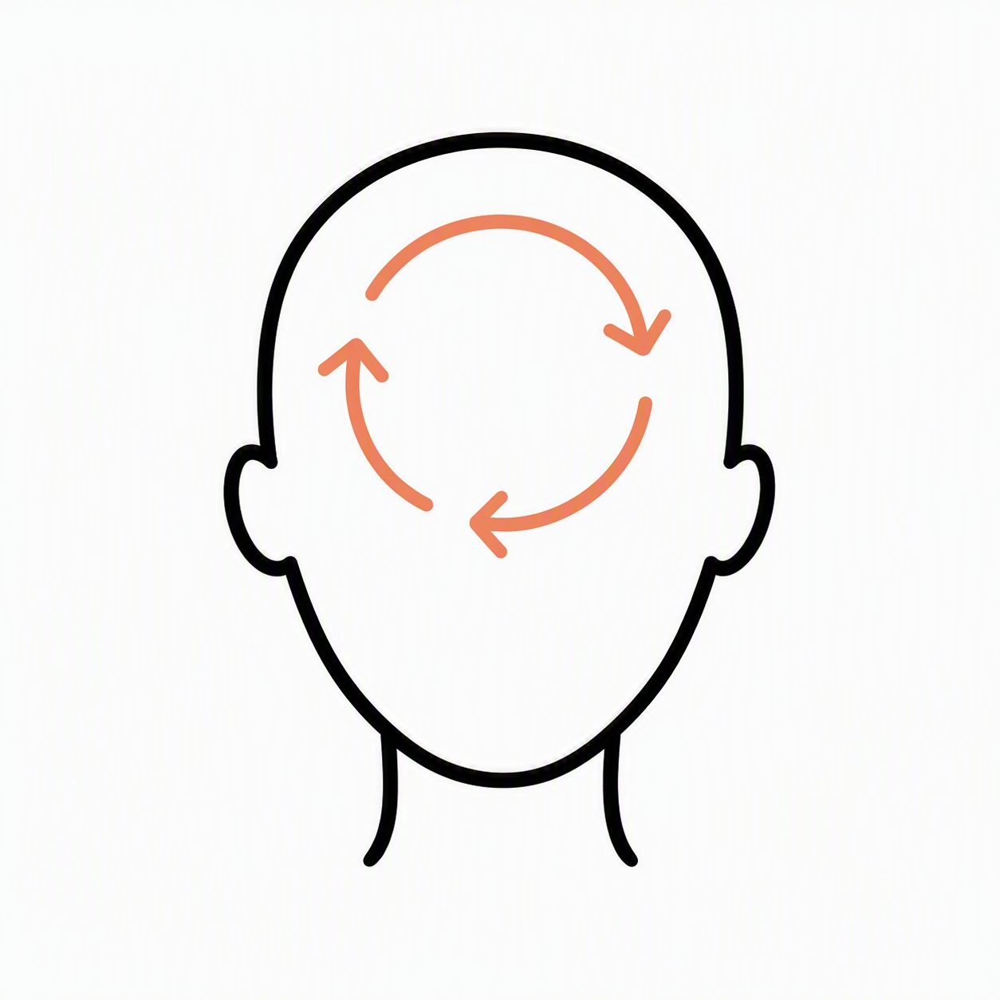

\# Adding and Amending Treatment Pages


This website has been designed so that all treatment pages follow a consistent structure and style. The easiest approach is always to copy an existing treatment page and update the content.


\---


\# Adding a New Treatment


\## Step 1 – Create the Treatment Image


Create a simple square JPG image in the same style as the existing treatment images:


\- White/light grey background

\- Black line art

\- Soft peach accent colour (#E7A07A)

\- Minimal, uncluttered design

\- Similar proportions to existing treatment images


Examples:


\- Anxiety

\- Sleep

\- Smoking \& Vaping

\- Low Mood

\- Negative Thinking

\- Habits


Save the image in:


```text

../images/

```


Examples:


```text

../images/anxiety.jpg

../images/sleep.jpg

../images/habits.jpg

../images/fear-of-flying.jpg

```


\---


\## Step 2 – Create the Treatment Page


Copy an existing treatment page.


Recommended pages to copy:


```text

anxiety.html

```


or


```text

sleep.html

```


Rename to the new treatment name, for example:


```text

habits.html

fear-of-flying.html

weight-loss.html

```


\---


\## Step 3 – Update the New Treatment Page


Open the copied page and amend the following items.


\### Page Title


Update the browser title:


```html

<title>Hypnotherapy for Habits | Hughes Hypnotherapy</title>

```


\---


\### Treatment Headline


Update the main treatment heading.


Example:


```text

Break Unhelpful Habits and Create Positive Lasting Change

```


\---


\### Hero Section H3


Update the hero section heading.


Example:


```html

<h3>Take Control of Your Habits</h3>

```


\---


\### Hero Image


Update the image reference.


Example:


```html



```


\---


\### Hero Paragraphs


Replace the existing introductory paragraphs.


These should typically explain:


\- The challenge

\- How it affects people

\- How hypnotherapy may help

\- The positive outcome


Keep content warm, positive and easy to read.


\---


\## Step 4 – Add the Treatment Card


Open:


```text

treatments.html

```


Scroll to the bottom of the treatment card section.


Copy the last treatment card and paste a new copy underneath.


Update:


\- Image

\- Title

\- Strapline

\- Link


Example:


```html

<div class="treatment-card">

&#x20;   


&#x20;   <h3>Habits</h3>


&#x20;   <p>Break unhelpful habits and create positive lasting change.</p>


&#x20;   <me Page Treatment Pills


Open:


```text

index.html

```


Locate the treatment pill list.


Copy an existing pill and amend the text and link.


Example:


```html

habits.htmlHabits</a>

```


Add the new treatment in a sensible position within the list.


\---


\# Writing Guidelines


\## Do


✅ Write in plain English


✅ Focus on benefits


✅ Keep sentences short


✅ Use a warm and supportive tone


✅ Explain concepts simply


✅ Encourage positive change


\---


\## Avoid


❌ Medical claims


❌ Guarantees of success


❌ Clinical jargon


❌ Overly long paragraphs


❌ Promising cures


\---


\# Strapline Formula


A good strapline usually follows:


```text

Action + Positive Outcome

```


Examples:


```text

Move Beyond Anxiety and Feel More in Control

```


```text

Improve Your Sleep and Wake Refreshed

```


```text

Quit Vaping or Smoking and Be Free

```


```text

Break Unhelpful Habits and Create Positive Lasting Change

```


\---


\# Final Checklist


Before publishing:


\- \[ ] Image created

\- \[ ] New treatment page copied

\- \[ ] Title updated

\- \[ ] Treatment headline updated

\- \[ ] Hero H3 updated

\- \[ ] Hero image updated

\- \[ ] Hero paragraphs updated

\- \[ ] Treatment card added to treatments.html

\- \[ ] Treatment pill added to index.html

\- \[ ] Mobile layout checked

\- \[ ] Spelling checked

\- \[ ] Links tested

\- \[ ] Disclaimer retained


\---


\# Disclaimer


The following disclaimer must remain visible on the website:


> Please be aware that results can differ for each client, as everyone is different. You will need to fully participate in the therapeutic process to maximise your chances of success.

